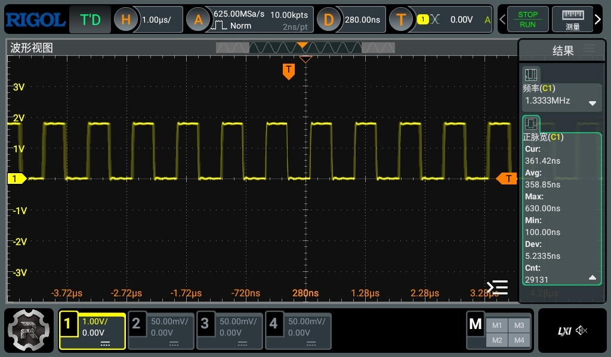
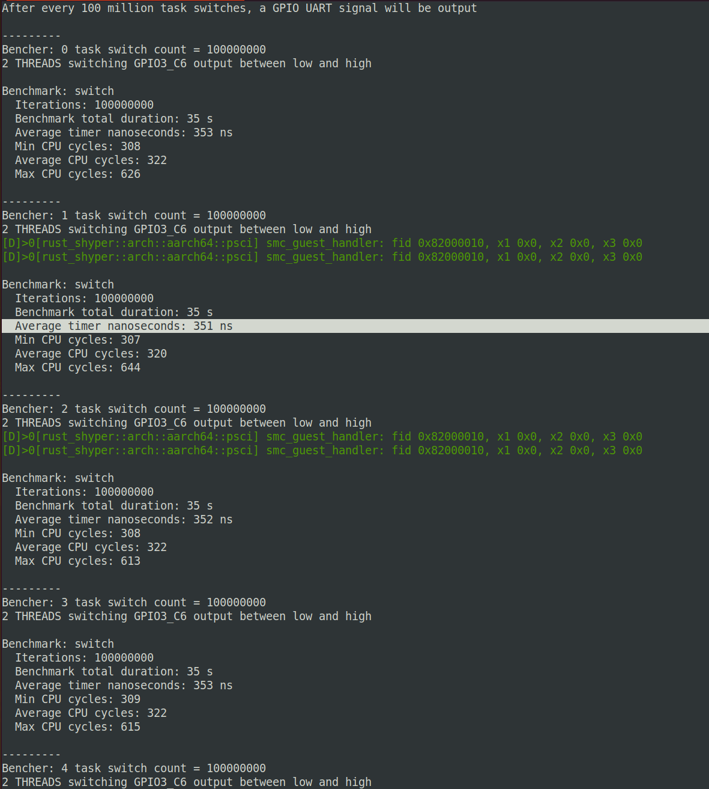

# Task Scheduling Benchmark

A benchmark suite for evaluating OS task scheduling performance, designed for the [ArceOS](https://github.com/rcore-os/arceos) operating system.

## Overview

This benchmark measures the performance of key task scheduling operations:

- **switch**: Context switch latency between two threads
- **rdtsc**: Timer read overhead (TSC on x86_64, CNTVCT_EL0 on aarch64)
- **spawn**: Thread creation and termination latency
- **condvar**: Condition variable wait/notify performance

## Building

### For ArceOS (aarch64)

```bash
# Build for QEMU
cargo build --features "axstd,qemu" --target aarch64-unknown-none-softfloat

# Build for RK3588
cargo build --features "axstd" --target aarch64-unknown-none-softfloat
```

## Running

### On QEMU

```bash
# From ArceOS root directory

make A=apps/bencher PLATFORM=aarch64-qemu-virt MODE=release LOG=info SMP=1 FEATURES="alloc,multitask,driver-ramdisk,irq" run
```

### On RK3588 Hardware

The benchmark outputs GPIO signals for hardware-level measurement:

- **GPIO3_C6**: Pulse signal for thread switching visualization
  - High level: Thread 0 running
  - Low level: Thread 1 running
- **UART7**: Serial output for benchmark results
- **LED indicators**:
  - Red LED (GPIO3_B2): Initialization complete
  - Green LED (GPIO3_C0): Benchmark running

Connect a logic analyzer or oscilloscope to GPIO3_C6 to measure actual context switch timing.

## Benchmark Details

### switch
Measures context switch latency between two cooperating threads.
- Each thread yields `iter/2` times
- Single switch time = total_time / iterations
- Default: 100,000,000 switches per measurement, repeated 100 times

### rdtsc
Measures the overhead of reading the system timer counter.
- x86_64: Uses `__rdtscp` instruction
- aarch64: Reads `CNTVCT_EL0` register

### spawn
Measures thread creation latency by spawning and joining threads in a loop.
- 500,000/200,000 iterations

### condvar (optional)
Measures condition variable signaling overhead.
- 5,000,000 iterations
- Uses wait queue OR standard Condvar

## Measurement Methodology

### Timing Sources

- **x86_64**: TSC (Time Stamp Counter) at assumed 4 GHz
- **aarch64**: 
  - `CNTVCT_EL0`: Generic timer counter (typically 24 MHz)
  - `PMCCNTR_EL0`: CPU cycle counter (CPU frequency dependent)

### PMU Configuration

On aarch64, the benchmark enables user-mode access to Performance Monitoring Unit (PMU):
- `PMUSERENR_EL0`: Enables EL0 access to performance monitors
- `PMCR_EL0`: Enables all counters with 64-bit overflow
- `PMCNTENSET_EL0`: Enables cycle count register

### Output Format




## Dependencies

- `axstd`: ArceOS standard library (optional, for ArceOS builds)
- `dw_apb_uart`: UART driver for RK3588 hardware output
- `aarch64-cpu`: AArch64 register access (aarch64 only)

